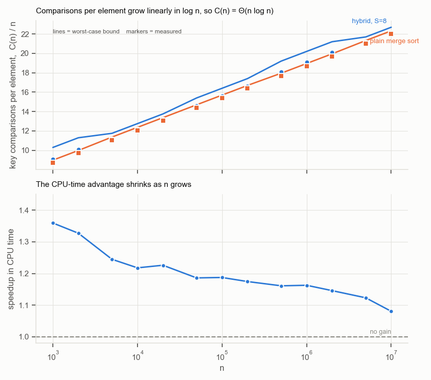
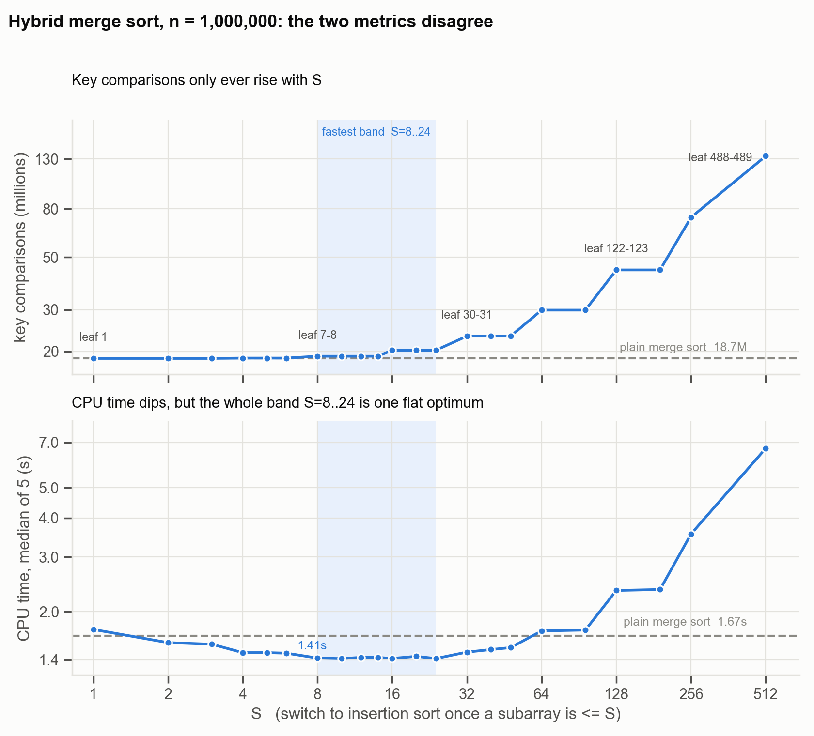
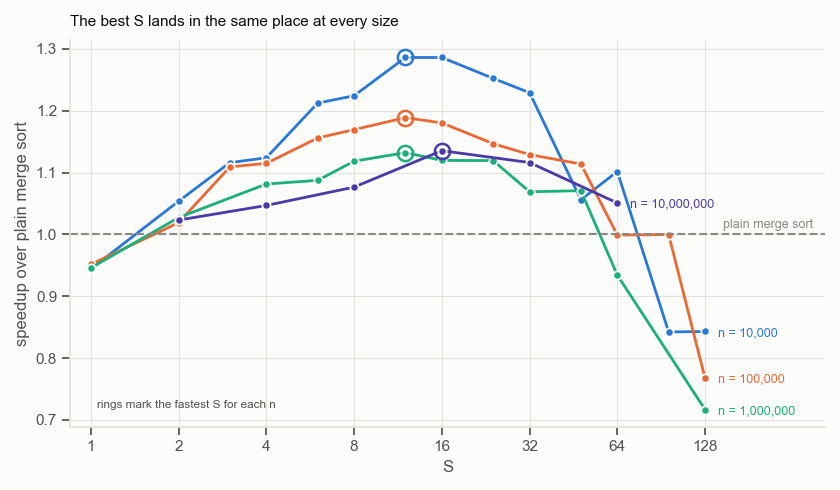

# 阈值 $S$

**SC2001 Project 1 —— 归并排序与插入排序的融合**

在小子数组上切换到插入排序的归并排序，比纯归并排序更快。但按照本作业要求绘制的每一项指标衡量，它又都更差。本报告调和这两个事实。

测量环境：Python 3.13，Apple Silicon，macOS 24.6，$n$ 最大至 $10^7$。所有图表均由 `results/` 目录下的 CSV 生成。

| | |
|---|---|
| **关键比较次数** | 对任何 $S$，混合算法所需的比较次数都不会少于纯归并排序。已精确证明。 |
| **CPU 时间** | 在 $n = 10^7$ 且取最优 $S$ 时快 11.9%：16.56 秒对 18.81 秒。 |
| **最优叶子大小** | 7–10，在跨越四个数量级的 $n$ 上保持恒定。 |

---

## 目录

1. [算法实现](#1-算法实现第-a-部分)
2. [输入数据](#2-输入数据第-b-部分)
3. [理论分析](#3-理论分析)
4. [比较次数随 $n$ 的变化](#4-比较次数随-n-的变化第-ci-部分)
5. [比较次数随 $S$ 的变化](#5-比较次数随-s-的变化第-cii-部分)
6. [如何选择 $S$](#6-如何选择-s第-ciii-部分)
7. [时间究竟花在哪里](#7-时间究竟花在哪里)
8. [与原始归并排序的对比](#8-与原始归并排序的对比第-d-部分)
9. [结论的适用边界](#9-结论的适用边界)
10. [结论](#10-结论)

---

## 1. 算法实现（第 a 部分）

混合算法就是在递归开头多加一行判断的归并排序。当子数组长度降到 $S$ 或更短时，它交给插入排序，而不再继续拆分。这个判断在每个分支上独立执行，因此树的不同部分会在各自长度所决定的深度上触底。

三个排序共用一套计数口径，每个都返回排好序的列表以及执行的关键比较次数：

| 函数 | 作用 |
|---|---|
| `hybrid(arr, S)` | 混合算法。$S = 1$ 时退化为纯归并排序，因为单元素子数组交给插入排序不产生任何代价。 |
| `mergesort(arr)` | 教科书版归并排序，一直递归到单个元素。第 (d) 部分的对照基线。 |
| `insertsort(arr)` | 插入排序，键归位后立即提前退出，因此具有自适应性，而非恒定处于最坏情况。 |

### 什么算一次关键比较

关键比较是指两个数组**元素**之间的一次比较：插入排序中的 `a[j] > key`，以及归并步骤中的 `a[i] <= b[j]`。诸如 `j >= 0` 和 `i < len(a)` 这类循环边界判断不计入，`len(arr) <= S` 这个尺寸判断同样不计入，因为它们都没有检视任何键值。这一点很重要——尺寸判断在每次递归调用时触发一次，若计入，会给小 $S$ 的计数额外叠加一个正比于 $n$ 的项。

### 正确性验证

模块每次执行时都会运行三项检查：

- 对 $n$ 从 0 到 4096，三种排序的结果都与 `sorted()` 一致；混合算法在 $S \in \{1, 2, 5, 16, 64, n+5\}$ 的每个取值下同样一致。
- **`hybrid(arr, 1)` 报告的比较次数与 `mergesort(arr)` 完全相同**——在 $n = 5000$ 时是 55,178 对 55,178。逐位相等说明切换逻辑既没有重复计数，也没有漏计任何一次比较。
- 插入排序具备自适应性：在长度 1000 的有序数组上是 999 次比较（$n-1$ 的最好情况），在逆序数组上是 499,500 次（$n(n-1)/2$ 的最坏情况）。

> **测量陷阱。** 携带计数器会使运行时间增加约 15%，因为递归的每一层都要打包和拆包一个元组。因此本报告中所有 CPU 时间均来自另一套不计数的孪生实现（`hybrid_nc`、`mergesort_nc`、`insertsort_nc`），它们除此之外逐行相同。比较次数与计时数据从不取自同一次运行。

---

## 2. 输入数据（第 b 部分）

数组元素为 $[1, x]$ 上的均匀随机整数，取 $x = 10^7$。十三个规模以 1–2–5 递进覆盖要求的范围——1000、2000、5000、10,000、……、10,000,000——使它们在第 (c) 部分所需的对数坐标轴上均匀分布。

数组采用**由种子重新生成而非存储**的方式。一千万元素的数组在内存中约占 400 MB；作为种子它只占一个整数，且运行结果完全可复现。生成时优先使用 numpy（约快 3 倍），无 numpy 时回退到标准库。

> **采样说明。** 在种子固定的情况下，较小的数组是较大数组的前缀。这是刻意为之：它在第 (c)(i) 部分中隔离出 $n$ 的影响，而不掺入不同规模之间的采样噪声。若要在多次重复上取平均，必须改变种子，而不能只是重复运行。

---

## 3. 理论分析

以下所有计数均为**最坏情况**。这是能写出闭式的情形，也是 $\Theta$ 分类所依据的情形。平均情况的行为改由实测给出，见第 4、5 节。

### 3.1 插入排序

把 $a[i]$ 插入长度为 $i$ 的有序前缀时，从右往左依次与前缀元素比较，直到遇到一个更小的为止。这至多为 $i$ 次比较；当键已经就位时至少为 1 次。对 $i = 1, \dots, m-1$ 求和：

$$
I_{\text{worst}}(m) \;=\; \sum_{i=1}^{m-1} i \;=\; \frac{m(m-1)}{2},
\qquad\qquad
I_{\text{best}}(m) \;=\; m-1
$$

区分这两者的正是提前退出。若没有它，每次插入都会扫完整个前缀，连有序数组也要付出 $m(m-1)/2$。

### 3.2 归并排序

归并两个长度分别为 $a$ 和 $b$ 的有序段时，每次比较移出一个元素，而最后一个元素无需比较即可搬出，因此一次归并至多耗费 $a+b-1$ 次。于是长度为 $m$ 的子数组满足如下递推，其中 $\mathit{MS}(1) = 0$：

$$
\mathit{MS}(m) \;=\; \mathit{MS}\!\left(\left\lfloor \tfrac{m}{2} \right\rfloor\right)
\;+\; \mathit{MS}\!\left(\left\lceil \tfrac{m}{2} \right\rceil\right) \;+\; (m-1)
$$

当 $m$ 为 2 的幂时可逐层求解。第 $k$ 层有 $m/2^k$ 次归并，每次归并两个长度为 $2^{k-1}$ 的段，各至多耗费 $2^k - 1$ 次，故该层耗费 $m - m/2^k$。对 $k = 1, \dots, \log_2 m$ 求和：

$$
\mathit{MS}(m) \;=\; \sum_{k=1}^{\log_2 m}\left(m - \frac{m}{2^k}\right)
\;=\; m\log_2 m \;-\; m \;+\; 1
$$

### 3.3 混合算法

取 $n$ 和 $S$ 均为 2 的幂，则全部 $n/S$ 个叶子的长度恰好都是 $S$。每个叶子至多耗费 $S(S-1)/2$，其上方 $\log_2(n/S)$ 层归并按 3.2 节同样的求和耗费 $n\log_2(n/S) - n/S + 1$。于是

$$
\boxed{\;C(n,S) \;=\; \frac{n(S-1)}{2} \;+\; n\log_2\!\frac{n}{S} \;-\; \frac{n}{S} \;+\; 1\;}
$$

令 $S = 1$ 即还原为 $\mathit{MS}(n) = n\log_2 n - n + 1$，与预期一致。两式相减得到设置阈值的代价——关于 $n$ 线性，系数仅取决于 $S$：

$$
\Delta(S) \;=\; C(n,S) - C(n,1) \;=\; n\left[\frac{S-1}{2} \;-\; \log_2 S \;+\; 1 \;-\; \frac{1}{S}\right]
$$

| $S$ | 1 | 2 | 4 | 8 | 16 | 32 | 64 |
|---|---:|---:|---:|---:|---:|---:|---:|
| $\Delta(S)/n$ | 0 | 0 | 0.250 | 1.375 | 4.438 | 11.469 | 26.484 |

**表 1.** 阈值在最坏情况下的每元素代价。

> $\Delta(S)$ 在 $S = 1$ 和 $S = 2$ 时为零，此后严格递增。**任何高于最小值的阈值都不会降低最坏情况的比较次数**——混合算法至多与纯归并排序打平，绝不可能胜出。第 5 节和第 8 节确认这一点在实测的平均情况下同样成立。

直觉可以直接从公式读出：提高 $S$ 是用 $\log_2 S$ 层归并（每层约 $n$ 次比较）去换叶子部分约 $nS/4$ 的代价。前者按对数节省，后者按线性支出，因此这笔交换从一开始就不划算。

### 3.4 渐近性

对任何**固定**的 $S$，叶子项为 $\Theta(nS) = \Theta(n)$，被 $n\log n$ 项所主导：

$$
C(n,S) \;=\; n\log_2 n \;+\; n\left[\frac{S-1}{2} - \log_2 S\right] \;-\; \frac{n}{S} \;+\; 1
\;=\; \Theta(n\log n)
$$

**阈值改变的是常数因子，绝不改变复杂度类别。** 只有当 $S$ 被允许随 $n$ 增长时这一点才会失效：在 $S = \Theta(n)$ 时整个数组都交给插入排序，代价变为 $\Theta(n^2)$。

### 3.5 单个子数组上会发生什么

最坏情况的公式表明阈值会增加比较次数。实测显示平均情况亦然。每种规模取 200,000 个随机数组：

| $m$ | 插入排序实测均值 | 归并排序实测均值 | 更省 |
|---:|---:|---:|:---|
| 2 | 1.00 | 1.00 | 平局 |
| 3 | 2.66 | 2.67 | 插入 |
| 4 | 4.92 | 4.67 | 归并 |
| 6 | 11.06 | 9.83 | 归并 |
| 8 | 19.28 | 15.74 | 归并 |
| 16 | 72.46 | 45.70 | 归并 |
| 32 | 275.39 | 121.49 | 归并 |
| 64 | 1067.44 | 305.17 | 归并 |

**表 2.** 单个子数组上的平均关键比较次数，实测值。

插入排序在 $m = 2$ 时打平，在 $m = 3$ 时以 0.01 次之差胜出，在此后的每个规模上都落败且差距迅速拉大。这是表 1 在平均情况下的对应物，指向同一个结论：**在关键比较次数上，提前终止递归从来不是一种改进。** 混合算法买到的东西不是更少的比较——第 7 节指出它究竟是什么。

## 4. 比较次数随 $n$ 的变化（第 c(i) 部分）

固定 $S = 8$，两种排序在全部十三个规模上运行。在对数-对数坐标上直接绘制 $C(n)$ 对 $n$ 的曲线是一种糟糕的检验，因为几乎任何超线性曲线在那里看起来都是直的。绘制 $C(n)/n$ 对 $\log n$ 的曲线要锐利得多：理论断言该量是**线性**的，因此任何偏离直线的形状都构成对模型的证伪。

**图 1.** 上：每元素比较次数随 $n$ 的变化。标记点为实测值，曲线为第 3.3 节的最坏情况上界 $C(n,S)/n$ 在实际切分下的取值。实测紧贴上界下方，两者都随 $\log n$ 线性上升，这正是 $\Theta(n\log n)$ 所预言的。下：CPU 时间优势，随 $n$ 增大从 1.36× 衰减到 1.08×。

| $n$ | 混合算法比较次数 | 归并比较次数 | 超出 | 混合 CPU | 归并 CPU | 加速比 |
|---:|---:|---:|---:|---:|---:|---:|
| 1,000 | 9,088 | 8,717 | +4.26% | 0.00053 s | 0.00072 s | 1.36× |
| 2,000 | 20,217 | 19,422 | +4.09% | 0.00121 s | 0.00161 s | 1.33× |
| 5,000 | 55,766 | 55,237 | +0.96% | 0.00373 s | 0.00464 s | 1.24× |
| 10,000 | 121,468 | 120,431 | +0.86% | 0.00825 s | 0.01005 s | 1.22× |
| 20,000 | 263,085 | 260,942 | +0.82% | 0.0189 s | 0.0232 s | 1.23× |
| 50,000 | 729,394 | 718,417 | +1.53% | 0.0501 s | 0.0595 s | 1.19× |
| 100,000 | 1,558,492 | 1,536,560 | +1.43% | 0.1071 s | 0.1272 s | 1.19× |
| 200,000 | 3,315,992 | 3,272,943 | +1.32% | 0.2304 s | 0.2706 s | 1.17× |
| 500,000 | 9,036,918 | 8,837,196 | +2.26% | 0.6255 s | 0.7263 s | 1.16× |
| 1,000,000 | 19,073,414 | 18,674,561 | +2.14% | 1.3307 s | 1.5472 s | 1.16× |
| 2,000,000 | 40,148,187 | 39,349,331 | +2.03% | 2.8853 s | 3.3060 s | 1.15× |
| 5,000,000 | 105,556,634 | 105,052,333 | +0.48% | 7.9996 s | 8.9849 s | 1.12× |
| 10,000,000 | 221,112,527 | 220,105,208 | +0.46% | 17.576 s | 18.994 s | 1.08× |

**表 3.** 第 (c)(i) 部分，$S = 8$。比较次数为精确值；CPU 时间在小规模上取 7 次运行的中位数，到一千万时降为 2 次。

"超出"这一列并非平滑下降，其原因贯穿整个第 (c) 部分。在 $S = 8$ 时，叶子的长度并非全是 8——它们是 $\lceil n/2^k \rceil$ 落到 8 或以下时的那个值。在 $n = 10^6$ 时是 7–8，但在 $n = 10^7$ 时是 4–5，更接近纯归并排序，这正是那里超出仅为 0.46% 的原因。**同一个 $S$ 在不同的 $n$ 上含义并不相同。**

图 1 回答了"与你的理论分析作对比"这一要求。实测计数紧贴第 3.3 节最坏情况上界的下方——纯归并排序低于上界 1.4% 至 2.9%，混合算法低 2.6% 至 5.9%。混合算法的差距更大，因为它的叶子项按 $S(S-1)/2$ 即插入排序的最坏情况计费，而随机数据的实际代价约为其一半。两条曲线都在 $\log n$ 上呈直线，斜率符合 $C(n,S)/n \sim \log_2 n$ 的要求，这就是第 3.4 节 $\Theta(n\log n)$ 论断在四个数量级上得到的验证。

---

## 5. 比较次数随 $S$ 的变化（第 c(ii) 部分）

在 $n = 1{,}000{,}000$ 上取二十二个 $S$ 值，每个计时五次。给定数组和 $S$ 后比较次数是确定的，因此只测一次；只有计时需要重复。

**图 2.** 两项指标指向相反的方向。关键比较次数（上）单调上升，从未低于纯归并排序的水平线。CPU 时间（下）下降至 $S = 8$–$24$ 附近的一段平坦最小值，之后才回升。若把两者画成双 $y$ 轴，会诱使读者去解读一个纯粹由两个刻度对齐位置造成的交叉点。

### $S$ 是被量化的

比较次数呈平台状分布，且平台边界与对半阶梯 $\lceil n/2^k \rceil$ 精确对齐。同一平台内的每个 $S$ 产生完全相同的执行过程——计数是逐位相等，而不仅仅是接近。**$S = 8, 10, 12, 14$ 并非四个相近的选择，而是同一个算法被测量了四次**，它们计时上约 1% 的离散度只是测量噪声，别无其他。

| $S$ | 叶子大小 | 关键比较次数 | 对归并之比 | CPU 中位数 | 加速比 |
|---:|:---:|---:|---:|---:|---:|
| 1 | 1 | 18,674,561 | 1.00× | 1.7526 s | 0.95× |
| 2 | 1–2 | 18,674,561 | 1.00× | 1.5903 s | 1.05× |
| 3 | 2–3 | 18,674,513 | 1.00× | 1.5717 s | 1.06× |
| 4 | 3–4 | 18,727,864 | 1.00× | 1.4766 s | 1.13× |
| 5 | 3–4 | 18,727,864 | 1.00× | 1.4769 s | 1.13× |
| 6 | 3–4 | 18,727,864 | 1.00× | 1.4710 s | 1.14× |
| **8** | **7–8** | **19,073,414** | **1.02×** | **1.4188 s** | **1.18×** |
| **10** | **7–8** | **19,073,414** | **1.02×** | **1.4128 s** | **1.18×** |
| **12** | **7–8** | **19,073,414** | **1.02×** | **1.4262 s** | **1.17×** |
| **14** | **7–8** | **19,073,414** | **1.02×** | **1.4252 s** | **1.17×** |
| **16** | **15–16** | **20,222,242** | **1.08×** | **1.4150 s** | **1.18×** |
| **20** | **15–16** | **20,222,242** | **1.08×** | **1.4370 s** | **1.16×** |
| **24** | **15–16** | **20,222,242** | **1.08×** | **1.4138 s** | **1.18×** |
| 32 | 30–31 | 23,186,948 | 1.24× | 1.4829 s | 1.13× |
| 40 | 30–31 | 23,186,948 | 1.24× | 1.5108 s | 1.11× |
| 48 | 30–31 | 23,186,948 | 1.24× | 1.5328 s | 1.09× |
| 64 | 61–62 | 29,880,484 | 1.60× | 1.7342 s | 0.96× |
| 96 | 61–62 | 29,880,484 | 1.60× | 1.7451 s | 0.96× |
| 128 | 122–123 | 44,185,373 | 2.37× | 2.3394 s | 0.71× |
| 192 | 122–123 | 44,185,373 | 2.37× | 2.3558 s | 0.71× |
| 256 | 244–245 | 73,735,430 | 3.95× | 3.5532 s | 0.47× |
| 512 | 488–489 | 133,829,093 | 7.17× | 6.6962 s | 0.25× |

**表 4.** 第 (c)(ii) 部分，$n = 1{,}000{,}000$。**叶子大小**一列给出插入排序实际接收到的子数组长度，它解释了每一个平台。加粗行为处于最快值 1% 以内者。纯归并排序：18,674,561 次比较，1.6713 秒。

与理论对照：每个实测计数都位于第 3.3 节最坏情况上界之下，且在真正有用的 $S$ 范围内两者贴合紧密——$S \leq 3$ 时相差 1.5%，$S = 8$ 时 5.6%，$S = 16$ 时 12.3%。此后差距扩大到 $S = 512$ 时的 47%，因为上界按插入排序的最坏情况 $S(S-1)/2$ 给叶子计费，而随机数据的实际代价约为其一半，且在大 $S$ 下叶子项几乎就是全部代价。**上界在算法有用的区间内是紧的，在算法不划算的区间才变松。**

> 比较次数曲线的最小值出现在 $S = 3$，此处它以 1870 万次中的 48 次之差低于纯归并排序——0.0003% 的改进，这正是表 2 中 $m = 3$ 处的近乎平局在完整规模上的体现。**若把第 (c)(ii) 部分严格理解为对关键比较次数的优化，答案就是 $S = 3$，而混合算法毫无意义。** CPU 时间曲线才是该算法证明自身价值的地方，第 7 节解释两者为何背离。

---

## 6. 如何选择 $S$（第 c(iii) 部分）

在跨越四个数量级的四个规模上重复扫描，每个 $S$ 都与纯归并排序在同一数组上对比计时。

**图 3.** 相对纯归并排序的加速比随 $S$ 的变化，每种输入规模一条曲线，圆环标出各曲线的最快点。尽管规模相差 1000 倍，最优点却彼此重叠。$n = 10^7$ 的曲线使用较粗的网格，因为每个点约需 35 秒。

| $n$ | 最优 $S$ | 叶子大小 | 混合 CPU | 归并 CPU | 加速比 |
|---:|---:|:---:|---:|---:|---:|
| 10,000 | 12 | 9–10 | 0.0081 s | 0.0104 s | 1.29× |
| 100,000 | 12 | 6, 7, 12 | 0.1063 s | 0.1263 s | 1.19× |
| 1,000,000 | 12 | 7–8 | 1.3484 s | 1.5267 s | 1.13× |
| 10,000,000 | 16 | 9–10 | 16.5645 s | 18.8082 s | 1.14× |

**表 5.** 各规模下最快的 $S$ 及其对应的叶子大小。最优 $S$ 在移动，最优叶子大小则不然。

> **在所有测试规模上，最优叶子大小都是 7–10**，尽管产生它的 $S$ 从 12 移到了 16。这正是理论所预测的：长度为 $m$ 的子数组上的抉择，权衡的是把它交给插入排序的代价与继续拆分它的代价，再加上每次调用的开销，而**这些量都不涉及 $n$**。该决策对子数组而言是局部的，因此其答案不可能取决于整个数组有多大。

由此得出实用建议：**报告最优叶子大小，而不是最优 $S$。** 引用"$S = 12$"是所测 $n$ 的产物——在 $n = 10^7$ 上同一个 12 给出的叶子是 4–5，会损失可得加速的 5%。而引用"在叶子大小 $\approx 8$ 处切换"则是可迁移的。

关于精度还有一点补充：在 $n = 10^6$ 上，$S = 8, 10, 12, 14$ 是同一个算法，而 $S = 16, 20, 24$ 与它们在五次运行的中位时间上仅差 0.07%。再多的重复也无法区分这两个平台。诚实的答案是一个区间，而非一个点。

---

## 7. 时间究竟花在哪里

第 3 节和第 5 节留下了一个表面上的矛盾：混合算法做了更多关键比较，却更早结束。答案在于关键比较并不是归并排序把时间花掉的地方。

### 7.1 两种排序实际执行了什么

| 操作 | 归并排序 | 插入排序 |
|:---|---:|---:|
| 递归调用 | 15 | 1 |
| ……其中排序单个元素的 | 8 | — |
| 归并步骤 | 7 | 0 |
| 列表切片 | 21 | 0 |
| 新分配的列表 | 15 | 1 |
| append / extend | 17 / 7 | 0 |
| **关键比较** | **~16** | **~19** |

**表 6.** 对一个 8 元素数组排序一次所执行的操作。

归并排序十五次调用中有八次是在排序单元素数组。它们检查一个长度、复制一个单元素列表、然后返回。它们执行零次比较、移动零个元素；它们存在的唯一理由是递归需要一个基准情形。

### 7.2 时间归因

把归并排序逐层剥离即可分离出每一项代价。以下为对 8 元素数组排序一次的微秒数，取 4000 个数组上 7 轮中的最优值：

| 层次 | µs / 次排序 | 增量 |
|:---|---:|---:|
| 仅递归 + 21 次切片 + 8 次叶子拷贝 | 1.046 | — |
| ……加上分配 7 个结果列表 | 1.340 | +0.294 |
| ……加上归并本身——**完整归并排序** | **2.810** | +1.470 |
| **完整的插入排序** | **0.980** | |
| **在 $m = 8$ 处切换所节省的** | **1.830** | |

**表 7.** 归并排序代价的分解。脚手架占了总量的一半。

这 1.830 µs 干净地分成两部分：

- **1.340 µs——整棵递归树消失了。** 十五次调用塌缩为一次；21 次切片、8 次叶子拷贝和 7 个结果列表塌缩为一次 `list(arr)`。这占归并排序总代价的 47.7%，全部花在把数组拆开再拼回去上。
- **0.490 µs——归并的内层循环单位代价更高。** 归并步骤本身耗时 1.470 µs，尽管少做了三次比较，却是**整个插入排序代价的 1.50 倍**。放置一个元素需要 `new.append(x)`，即一次属性查找加一次方法调用；而插入排序做的是 `arr[j+1] = arr[j]`，一条存储指令。归并循环还在每次迭代中重新求值 `len(a)` 和 `len(b)`。

### 7.3 这笔交易为何如此悬殊

两类代价在递归树上的分布方式不同，这种不对称就是全部答案。

树的每一层总共归并 $n$ 个元素，因此**每一层约耗费 $n$ 次比较**。在 $\log_2 n$ 层上，比较工作量是均匀铺开的：在 $n = 10^6$ 时，约 20 层中的每一层各占总量的约 5%。

节点数则不是均匀分布的。$n$ 个元素的树有 $n$ 个叶子和 $n-1$ 个内部节点，因此**仅最底一层就占了全部节点的一半**：

$$
\frac{\text{最底 } j \text{ 层的节点数}}{\text{总节点数}}
\;=\; \frac{n + \frac{n}{2} + \dots + \frac{n}{2^{\,j-1}}}{2n - 1}
\;\approx\; 1 - 2^{-j}
$$

于是最底三层占了其中的 87.5%。

> 在叶子大小 8 处切断即移除最底三层。这舍弃了**全部函数调用、切片和内存分配中的 87.5%**，换来的代价是三层的比较工作量——插入排序随后以略差的效率重做这部分，多花约 2% 的比较。在 $n = 10^6$ 上实测：**比较次数 +2.1%，CPU 时间 −15%。**

### 7.4 两个交叉点

由于两项指标衡量的是不同的东西，它们在不同的子数组长度上交叉。比较次数取每种规模 200,000 个随机数组的实测值，计时取五次中的最优值：

| $m$ | 比较次数更省者 | CPU 时间更快者 | 归并/插入 时间比 |
|---:|:---|:---|---:|
| 2 | 平局 | 插入 | 2.32× |
| 4 | 归并 | 插入 | 2.99× |
| 8 | 归并 | 插入 | 2.77× |
| 16 | 归并 | 插入 | 2.30× |
| 32 | 归并 | 插入 | 1.56× |
| 64 | 归并 | **归并** | 0.87× |

**表 8.** 在小子数组上按各指标衡量谁胜出。比较次数的交叉点在 $m \approx 3$；CPU 时间的交叉点在 $m \approx 48$。

作业本身的表述已经预示了这一点：它用"大量递归调用的开销"来论证混合算法的必要性，而不是用比较次数。表 7 就是这句话的量化版本。

---

## 8. 与原始归并排序的对比（第 d 部分）

在 $n = 10{,}000{,}000$ 上，采用第 (c)(iii) 部分得出的最优 $S = 16$，对照第 1 节的教科书版归并排序。两种排序均已验证产生相同输出。

| | 关键比较次数 | 对归并 | CPU 时间 | 对归并 |
|:---|---:|---:|---:|---:|
| **混合算法，$S = 16$** | **226,423,622** | **+2.87%** | **16.564 s** | **−11.9%** |
| 混合算法，$S = 8$ | 221,112,527 | +0.46% | 17.472 s | −7.1% |
| *纯归并排序* | *220,105,208* | — | *18.808 s* | — |

**表 9.** 一千万整数上的正面对决。两个算法排序的是同一个数组。

这个结果就是本报告论点的一行浓缩。**混合算法多做了 630 万次关键比较，却仍早 2.24 秒完成。** 在第 (c)(i) 和 (c)(ii) 部分要求绘制的指标上它输了；在第 (d) 部分要求测量的指标上它赢了 11.9%。

$S = 8$ 那一行从另一个角度展示了量化效应：它多付出的比较次数少得多（+0.46%），恰恰因为它的叶子只有 4–5 个元素，而它也相应地更慢，只捕获了 7.1% 而非 11.9% 的加速。更少的比较、更低的速度——在 $S$ 的整个有用范围上，两项指标是反相关的。

> **运行间方差。** 一千万规模的纯归并排序在第 (c)(iii) 部分的运行中测得 18.808 秒，在第 (d) 部分的独立运行中测得 18.298 秒，两次会话间相差 2.7%。在此规模下，低于约 3% 的差异不应被视为真实。11.9% 的差距远在该带宽之外；而 $S = 12$ 与 $S = 16$ 之间的差距则不是。

---

## 9. 结论的适用边界

**最优值是实现常数，而非算法性质。** 表 7 把归并排序 47.7% 的代价归因于切片与内存分配。基于索引的原地归并排序，使用一个预分配缓冲区并传递 $(lo, hi)$ 而非子列表，可消除其中的大部分，只留下函数调用本身。它的交叉点会落在更小的 $m$ 上，最优叶子大小会低于 8。"叶子大小 $\approx 8$"这个数字是本实现和本语言特有的；可迁移的是**推理过程**，而非这个数字。这一点未经实测，仅作为预期而非结论陈述。

**仅涵盖均匀随机数据。** 插入排序的提前退出使其具有很强的自适应性——有序输入上 999 次比较，逆序输入上 499,500 次。在部分有序的数据上，最优 $S$ 会更大，可能大得多。本报告未对该情形做任何测量。

**嵌套数据集。** 在固定种子下，每个规模都是下一个规模的前缀。这通过消除规模间的采样噪声锐化了第 (c)(i) 部分，但这十三个点并非独立抽样，因此跨规模的置信区间会偏乐观。

**大规模处计时重复次数偏少。** 一千万元素的运行重复了 2 次，五百万重复 3 次。结合 2.7% 的会话间方差，大 $n$ 处的加速比带有约 ±3% 的不确定度。比较次数则不带任何不确定度——它们是精确的。

**重复键。** 取值来自 $[1, 10^7]$ 而 $n = 10^7$ 时，约 37% 的条目是重复值。归并使用 `a[i] <= b[j]`，因此相等时取左段，使排序稳定并把相等情形的代价固定为一次比较。换一种相等处理约定会使计数略有变化。

---

## 10. 结论

混合算法值得使用，但理由并非第 (c)(i) 和 (c)(ii) 部分那个指标所暗示的那个。

1. **在关键比较次数上混合算法从未胜出。** 最坏情况下 $\Delta(S)$ 仅在 $S = 1, 2$ 时为零，此后递增；实测平均情况下最优阈值是 $S = 3$，在 1870 万次中只省下 48 次。两者指向同一结论。

2. **在 CPU 时间上它在一千万规模下胜出 11.9%。** 收益来自删除递归树最底的三层，那里集中了 87.5% 的调用、切片和内存分配，却只承担约 15% 的比较工作量。

3. **最优叶子大小为 7–10 且不依赖于 $n$**，因为子数组上的抉择只涉及该子数组自身的长度。应当报告叶子大小；实现它的 $S$ 被 $\lceil n/2^k \rceil$ 量化，会随输入规模移动。

4. **对任何固定的 $S$，混合算法仍是 $\Theta(n\log n)$。** 阈值买到的是常数因子，绝不是复杂度类别。

更广的方法论意义在于：两项指标在 $S$ 的整个有用范围上是反相关的，因此一份优化关键比较次数的报告和一份优化运行时间的报告，会从同一批数据得出相反的结论。哪个正确取决于这个计数当初是什么东西的代理指标——而在纯 Python 中，在一个 8 元素子数组上，它是大约一半工作量的代理。

---

## 附录 —— 如何复现

| 文件 | 内容 |
|:---|:---|
| `hybrid.py` | 三个带比较计数的排序，以及用于计时的不计数孪生实现。运行它会执行验证套件。 |
| `datagen.py` | 基于种子的数组生成与规模阶梯。 |
| `experiments.py` | 第 (c)(i)、(c)(iii) 和 (d) 部分。约 15 分钟；写出三个 CSV。 |
| `bench.py` | 第 (c)(ii) 部分：$S$ 扫描，以及平台列背后的 `leafsizes` 辅助函数。 |
| `overhead.py` | 表 6 和表 7。必须在空闲机器上运行。 |
| `plots.py` | 图 1–3，由 CSV 绘制。 |

所有数字均由上述脚本生成并存放于 `results/*.csv`。比较次数是精确的，可由种子复现；CPU 时间在一台空闲的 Apple Silicon 机器上、Python 3.13 环境下测得，在其他硬件上会有差异。

> 图中的坐标轴标签保留英文，与代码和 CSV 的列名保持一致。
